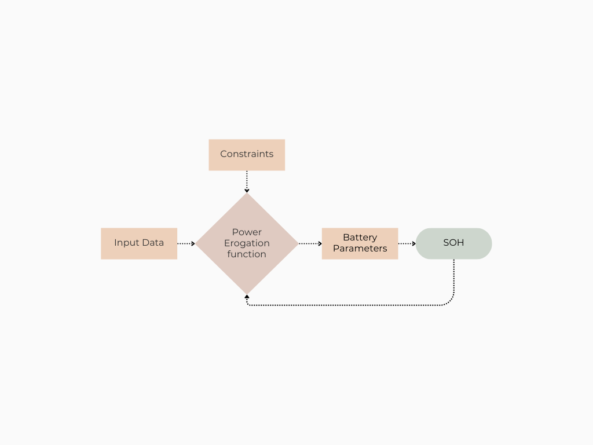

# eBike Smart Assist

**EESTech Challenge Hackathon — May 2025**

A web application that optimises e-bike battery usage along a planned route, adapting motor power delivery in real time to match the rider's effort preference and arrival battery target.

**Team:** Nicola Battison · Christian Faccio · Manuel Magnabosco

---

## Problem

Current e-bike energy management systems have three main shortcomings:

- **Binary assist levels** force the rider to manually switch between a handful of fixed power steps.
- **No route awareness** — the motor has no knowledge of upcoming hills or the remaining distance.
- **Battery anxiety** — riders often run out of charge before completing the trip with no advance warning.

## Solution

eBike Smart Assist lets the rider express intent in natural terms ("I want a moderate workout, arriving with ≥ 30 % battery") and handles the rest automatically.

The app takes a GPS route, the rider's effort preference (1–5 scale), a target speed mode (Eco / City / Sport), and the desired arrival battery level, then computes a per-segment power schedule that satisfies all constraints.



---

## Features

| Area | Details |
|---|---|
| Route upload | GPX, CSV, TCX files; mock generator for demos |
| Optimisation engine | Linear programming (PuLP-WASM) with heuristic fallback |
| Battery health model | SOH (State of Health) degradation estimate per ride, based on NASA battery dataset |
| Real-time simulation | Second-by-second ride playback with dynamic power recommendations |
| Infeasibility handling | Detects when constraints cannot be met and suggests parameter adjustments |
| Visualisations | Elevation profile, per-segment power allocation, live battery chart |

---

## Tech Stack

**Frontend**

- React 18 + TypeScript
- Vite (build tool)
- Tailwind CSS
- Recharts (data visualisation)
- React Router v6

**Optimisation**

- [PuLP-WASM](https://github.com/coin-or/pulp) — linear programming solver compiled to WebAssembly, running entirely in the browser
- Heuristic fallback algorithm for environments where WASM is unavailable

**Data & Research**

- NASA battery degradation dataset (SOH modelling)
- Python / Jupyter for exploratory analysis (see [`research/`](research/))

---

## How It Works

```
1. Upload Route      →  parse GPX/CSV, extract elevation profile
2. Set Preferences   →  effort level, speed mode, completion time, rider weight
3. Optimise          →  LP solver minimises SOH degradation subject to power-balance
                        and hardware constraints (32–42 V, 0–15 A per segment)
4. Ride              →  real-time adjustment recommendations as terrain changes
```

The optimisation objective is to minimise battery stress (voltage and current deviation from nominal), which directly extends battery lifespan.

---

## Project Structure

```
├── app/                   React + TypeScript web application
│   └── src/
│       ├── pages/         Dashboard, RouteAnalysis, BatteryOptimizer, RealTimeAdjustments
│       ├── components/    Charts, layout components, UI primitives
│       ├── context/       Global state (BatteryContext)
│       ├── utils/         optimizeBattery(), getRealTimePowerRecommendation()
│       └── types/         Shared TypeScript interfaces
├── data/                  GPS traces and battery health datasets (CSV, GPX)
├── research/              Jupyter notebook, PDF reports, degradation plots, MATLAB data
├── prototype/             Early Python prototype (Streamlit UI, SOH model, GPX converters)
└── scheme.png             System architecture diagram
```

> **Note:** `research/` contains the exploratory data analysis and battery degradation modelling. `prototype/` is the initial Python/Streamlit proof of concept built before the React app.

---

## Getting Started

```bash
cd app
npm install
npm run dev
```

The app runs at `http://localhost:5173`. No backend is required — the optimisation runs fully in-browser via WebAssembly.

To try it without a real route file, click **"Generate Mock Route"** on the Route Analysis page.

---

## Research Background

Battery State of Health (SOH) degradation was modelled using the [NASA Battery Aging Dataset](https://www.nasa.gov/content/prognostics-center-of-excellence-data-set-repository). The [`research/hackathon.ipynb`](research/hackathon.ipynb) notebook contains the full exploratory analysis, degradation model fitting, and capacity plots.

---

## Future Work

- Integration with real Google Maps / Strava route APIs
- On-bike hardware interface for live power delivery
- Personalised SOH model trained on individual rider history
- Alternative route suggestion when constraints are infeasible
